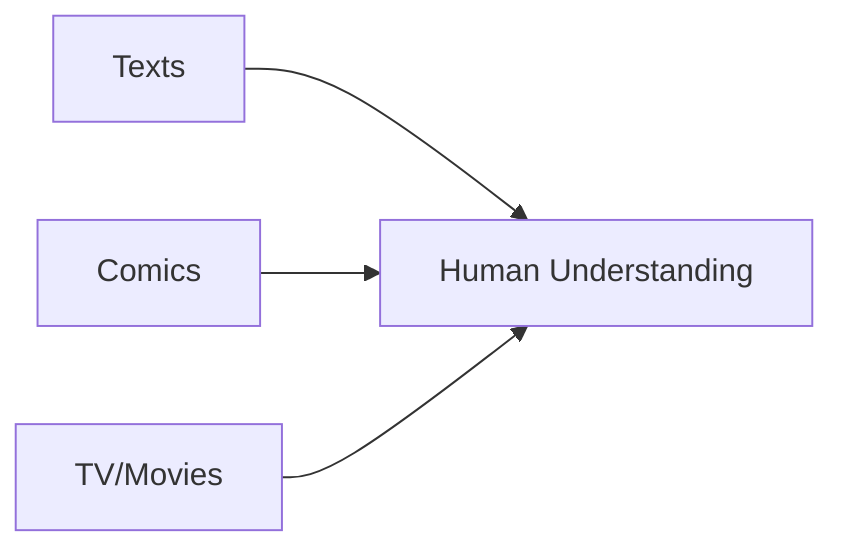

# 🧠💻 Media Comprehension Lab

> Where minds meet media, and understanding unfolds

## 🔬 About Us

Welcome to the Media Comprehension Lab, directed by Joe Magliano. We're on a mission to decode the intricate processes behind how humans understand and interact with various forms of media.

## 🎯 Our Research Focus

### 1. 📚🎬 Cross-Media Experience

We investigate how adults process information across different media types, exploring the commonalities and unique aspects of these experiences.

### 2. 🧠💪 Individual Variability
```
+-----------------+
|    Readiness    |
|       for       |
|  +-----------+  |
|  |  College  |  |
|  | Workforce |  |
|  | Lifelong  |  |
|  | Learning  |  |
|  +-----------+  |
+-----------------+
```
We study the diverse factors that contribute to an individual's success in processing media, with implications for educational and professional preparedness.

### 3. 🗣️🖥️ Constructed Responses
```python
def analyze_responses(responses):
    insights = computational_analysis(responses)
    return insights

media_understanding = analyze_responses(constructed_responses)
```
We employ computational methodologies to analyze how adults articulate their understanding of various media through writing or speech.

## 🚀 Join Us in Our Quest

Whether you're a fellow researcher, a curious student, or an industry partner, we invite you to explore our work and collaborate with us in unraveling the mysteries of media comprehension.

---

<div align="center">

📧 Contact | 🔗 Website | 📚 Publications

</div>
